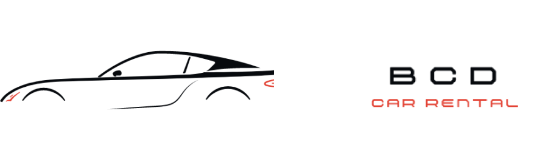

[](https://github.com/username/repo)

A convenient and user-friendly platform to rent cars with ease. BCD Car Rental offers a seamless experience for browsing, selecting, and booking vehicles for any occasion.

[](https://github.com/username/repo)

# **BCD Car Rental**
---

## **Table of Contents**

- [System Overview](#system-overview)
- [Functional Requirements](#functional-requirements)
- [Technologies Used](#technologies-used)
- [Prerequisite](#prerequisite)
- [Installation](#installation)
- [Business Requirements and ERD](#business-requirements-and-erd)
- [Gantt Chart](#gantt-chart)
- [User Interface](#user-interface)
- [Contributors](#contributors)

---

## **System Overview**

BCD Car Rental is designed to provide a hassle-free car rental process. Users can search for cars, view details, and book them online. The system ensures smooth management of car inventory, customer reservations, and payment processing.

---

## **Functional Requirements**

1. **User Registration & Login**: Allow users to create accounts and log in securely.
2. **Car Browsing & Searching**: Enable users to browse or search for cars based on categories, price, and availability.
3. **Booking System**: Users can reserve cars for specific dates and times.
4. **Payment Integration**: Provide online payment options for a seamless checkout process.
5. **Admin Dashboard**: Manage car inventory, bookings, and customer data.

---

## **Technologies Used**


---

## **Prerequisite**

Ensure you have the following installed on your system:

- **Python**: `python --version`  
- **Git**: `git --version`

---

## **Installation**

Follow these steps to set up the project locally:

1. **Clone the Repository**  
   ```bash
   git clone https://github.com/Amarok1214/BCD
2. Open the repository on any code editor
3. Create a virtual environment
   ```sh
   python -m venv venv
   ```
4. Activate the virtual environment
   ```sh
   venv/Scripts/activate
   ```
5. Install Requirements
   ```sh
   pip install -r requirements.txt
   ```
6. Change directory to BCD
   ```sh
   cd BCD
   ```
7. Run the server
   ```sh
   python manage.py runserver
   ```
8. Reach out to us for you to get the necessary api keys for the project
   
---

## **Business Requirements and ERD**

[](https://docs.google.com/document/d/1ZQrwfTTLDZfW4NPqRAAWU3ODCyOcgJcZ/edit?usp=sharing&ouid=102880266303764479739&rtpof=true&sd=true)

---

## **Gantt Chart**

The Gantt Chart outlines the timeline for the project's milestones and deliverables.

[](https://docs.google.com/spreadsheets/d/1qrNXIpmN1lzh68arGhznQi-Fn3tIMjYHbfhoSnXy6qA/edit?usp=sharing)

---

## **User Interface**

Our user interface focuses on simplicity and usability. Key features include:

[](https://www.figma.com/design/EHibZ0RhUmuKuVeyuhuu9s/BCD-Car-Rental?node-id=32-27&t=PyF1vBw5yCnoxuH6-1)

---

## **Contributors**

- **[Karl T. Baricuatro]**
- **[Xyrill Dereck N. Cañete]**
- **[Jestopher B. Dela Torre]**

<a href="https://github.com/Amarok1214/BCD/graphs/contributors">
  
</a>

Feel free to reach out for collaboration or inquiries.  

---

## **Get Started Now!**

Explore the system by cloning the repository and setting it up on your local machine. Happy renting!
